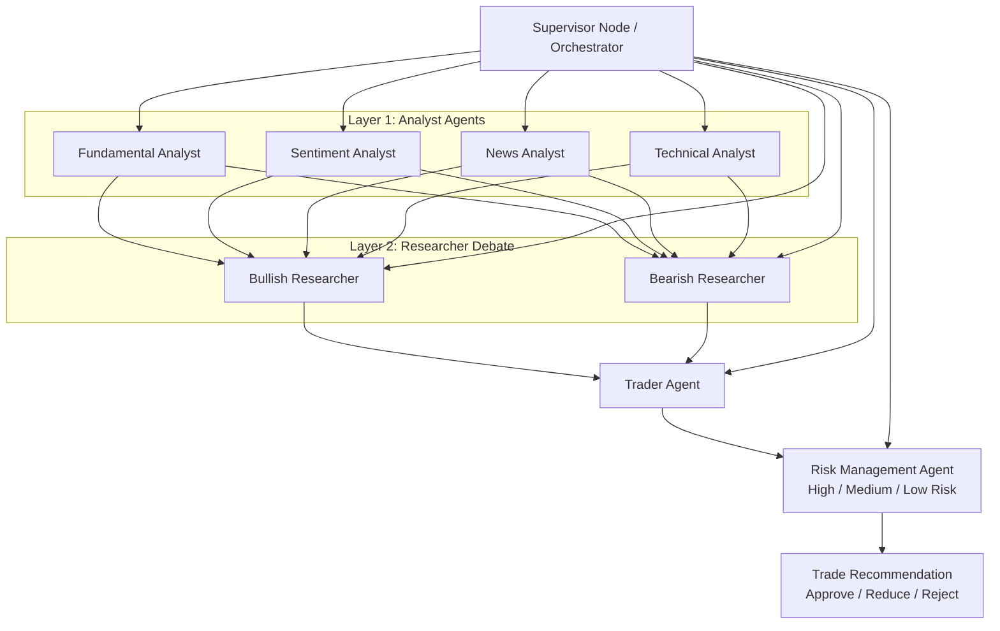

# System Architecture

This file tracks the evolving system architecture for the Crypto Trading AI Agent.

## Supervisor Node Architecture

The `Supervisor Node` is the orchestrator. It calls agents in sequence, gathers their outputs, and moves the decision through analysis, debate, trade synthesis, and risk review.

## Agent Responsibilities

- `Supervisor Node`: orchestrates calls across all layers and manages execution order.
- `Fundamental Analyst`: evaluates project, token, protocol, and macro fundamentals.
- `Sentiment Analyst`: evaluates crowd and market sentiment signals.
- `News Analyst`: evaluates recent news and event-driven catalysts.
- `Technical Analyst`: evaluates chart structure, trend, momentum, and indicators.
- `Bullish Researcher`: argues the strongest long or positive case from analyst evidence.
- `Bearish Researcher`: argues the strongest short, defensive, or negative case from analyst evidence.
- `Trader Agent`: synthesizes the debate into a preliminary trade decision.
- `Risk Management Agent`: classifies the trade as high, medium, or low risk and gates the final recommendation.

## Notes

- The first implementation should stay in `paper trading` mode.
- Risk control must exist before live execution is allowed.
- The architecture diagram should be added or updated whenever a new subsystem becomes real code.
