# System Architecture

This file tracks the evolving system architecture for the Crypto Trading AI Agent.

## Current Runtime Architecture

The architecture now consists of a `Data Foundation Node` for Binance ingestion and persistent storage, an `AI Engineering Layer` for retrieval, memory construction, and vector search, and a `Supervisor Node` that orchestrates four `Layer 1` agents against a shared local LLM runtime powered by Ollama with `gemma4:12b`.

```mermaid
%%{init: {
  "theme": "base",
  "htmlLabels": true,
  "themeVariables": {
    "fontSize": "26px",
    "fontFamily": "Arial",
    "primaryTextColor": "#111827",
    "lineColor": "#374151",
    "clusterBkg": "#ffffff",
    "clusterBorder": "#9ca3af"
  },
  "flowchart": {
    "nodeSpacing": 34,
    "rankSpacing": 44,
    "curve": "basis",
    "padding": 8
  }
}}%%

flowchart TB

  %% =========================
  %% EXTERNAL DATA SOURCES
  %% =========================
  subgraph sources["External Data Sources"]
    direction LR

    binance_rest["<b>Binance REST API</b><br/>Historical and latest market data"]
    binance_ws["<b>Binance WebSocket API</b><br/>Live candles and price stream"]
    data_vision["<b>Binance Data Vision</b><br/>Bulk historical market data"]
  end

  %% =========================
  %% DATA FOUNDATION NODE
  %% =========================
  subgraph foundation["Data Foundation Node"]
    direction LR

    rest_backfill["<b>REST Kline Backfill</b><br/>Downloads historical candles"]
    live_collector["<b>WebSocket Live Collector</b><br/>Collects real-time candles"]
    bulk_downloader["<b>Data Vision Bulk Downloader</b><br/>Loads large historical datasets"]
    validator["<b>Validation + Repair</b><br/>Missing candles • duplicates • quality checks"]
  end

  database[("<b>Market Database</b><br/>Clean OHLCV • features • signals • logs")]

  binance_rest --> rest_backfill
  binance_ws --> live_collector
  data_vision --> bulk_downloader

  rest_backfill --> validator
  live_collector --> validator
  bulk_downloader --> validator

  validator --> database

  %% =========================
  %% EVIDENCE LAYER
  %% =========================
  subgraph evidence_layer["Evidence + Report Layer"]
    direction LR

    feature_builder["<b>Feature Builder</b><br/>Returns • volatility • trend • indicators"]
    evidence_bundle["<b>Evidence Report Bundle</b><br/>Market report • risk context • tool outputs"]
  end

  database --> feature_builder
  feature_builder --> evidence_bundle

  %% =========================
  %% AI ENGINEERING LAYER
  %% =========================
  subgraph ai_engineering["AI Engineering Layer — RAG + FAISS Memory"]
    direction LR

    memory_builder["<b>Memory Builder</b><br/>Collects agent outputs • decisions • outcomes • reflections"]
    memory_summaries["<b>Memory Summaries</b><br/>Compressed lessons • trade reflections • research notes"]
    embedding_model["<b>Embedding Model</b><br/>Converts memory summaries into vectors"]
    faiss[("<b>FAISS Vector Database</b><br/>Shallow • intermediate • deep memory")]
    rag["<b>Agentic RAG</b><br/>Retrieves similar setups • builds memory context"]
  end

  memory_builder --> memory_summaries
  memory_summaries --> embedding_model
  embedding_model --> faiss
  faiss --> rag

  database -.-> memory_builder
  evidence_bundle --> rag

  %% =========================
  %% MODEL CALLING LAYER
  %% =========================
  subgraph model_layer["Model Calling Layer"]
    direction LR

    context_builder["<b>Context Builder</b><br/>Combines evidence report • RAG memory • portfolio state"]
    model_gateway["<b>Model Gateway</b><br/>Ollama call • prompt template • logging"]
    llm["<b>Ollama Local LLM</b><br/>Gemma 4 12B • structured reasoning output"]
    output_validator["<b>Output Validator</b><br/>Schema check • safety check • reject invalid output"]
  end

  evidence_bundle --> context_builder
  rag --> context_builder
  context_builder --> model_gateway
  model_gateway --> llm
  llm --> output_validator

  %% =========================
  %% AGENT LAYER
  %% =========================
  subgraph agent_layer["Layer 1 — AI Agents"]
    direction LR

    analyst["<b>Analyst Agent</b><br/>Technical analysis • market interpretation"]
    researcher["<b>Researcher Agent</b><br/>Research review • news context • memory-grounded reasoning"]
    trader["<b>Trader Agent</b><br/>Creates trade intent • does not execute"]
    risk["<b>Risk Management Agent</b><br/>Approves • downgrades • blocks unsafe decisions"]
  end

  supervisor["<b>Supervisor Node</b><br/>Orchestrates agents • collects reports • controls final decision"]

  output_validator --> supervisor

  supervisor --> analyst
  supervisor --> researcher
  supervisor --> trader
  supervisor --> risk

  analyst --> researcher
  researcher --> trader
  trader --> risk
  risk --> supervisor

  rag --> analyst
  rag --> researcher
  rag --> trader
  rag --> risk

  %% =========================
  %% MEMORY WRITEBACK
  %% =========================
  analyst -.-> memory_builder
  researcher -.-> memory_builder
  trader -.-> memory_builder
  risk -.-> memory_builder
  supervisor -.-> memory_builder

  %% =========================
  %% STYLING
  %% =========================
  classDef source fill:#f3f4f6,stroke:#6b7280,stroke-width:3px,color:#111827,font-size:26px;
  classDef data fill:#e8f1ff,stroke:#4a6fa5,stroke-width:3px,color:#1d2b44,font-size:26px;
  classDef evidence fill:#eef9ef,stroke:#4f8a54,stroke-width:3px,color:#18351c,font-size:26px;
  classDef memory fill:#ecfeff,stroke:#0891b2,stroke-width:3px,color:#164e63,font-size:26px;
  classDef model fill:#fff7ed,stroke:#ea580c,stroke-width:3px,color:#431407,font-size:26px;
  classDef agent fill:#f0edff,stroke:#6b5ca5,stroke-width:3px,color:#241b4a,font-size:26px;
  classDef supervisorStyle fill:#f5f3ff,stroke:#4c1d95,stroke-width:4px,color:#241b4a,font-size:27px;

  class binance_rest,binance_ws,data_vision source;
  class rest_backfill,live_collector,bulk_downloader,validator,database data;
  class feature_builder,evidence_bundle evidence;
  class memory_builder,memory_summaries,embedding_model,faiss,rag memory;
  class context_builder,model_gateway,llm,output_validator model;
  class analyst,researcher,trader,risk agent;
  class supervisor supervisorStyle;
```

## Agent Responsibilities

- `Data Foundation Node`: ingests Binance market data, validates candles, repairs gaps, and maintains the SQLite `clean_ohlcv` store.
- `Database`: is the persistent store for QuantCrypt market and system data.
- `AI Engineering Layer`: prepares retrieval-ready context, builds memory artifacts, and serves semantic retrieval to the agent layer.
- `Memory Builder`: converts system outputs and historical data into retrieval-ready memory artifacts.
- `Memory Summaries and Reflections`: hold past decisions, trade outcomes, market summaries, research notes, and risk verdicts in summarized form.
- `Agentic RAG`: retrieves structured evidence from the database and semantic evidence from memory retrieval.
- `FAISS Vector Database`: stores embeddings for summarized memory artifacts rather than raw candle data.
- `Supervisor Node`: orchestrates calls across all layers, manages execution order, and makes the final decision.
- `Analyst Agent`: performs fundamental, sentiment, news, and technical analysis.
- `Researcher Agent`: debates the analyst output through bullish and bearish reasoning inside one node.
- `Trader Agent`: synthesizes the debate into a preliminary trade decision.
- `Risk Management Agent`: classifies the trade as high, medium, or low risk and returns the risk view to the supervisor.
- `Ollama Local LLM - Gemma4 12B`: provides the shared chat backend used by the four Layer 1 agents.

## Notes

- The first implementation should stay in `paper trading` mode.
- Risk control must exist before live execution is allowed.
- The architecture diagram should be added or updated whenever a new subsystem becomes real code.
