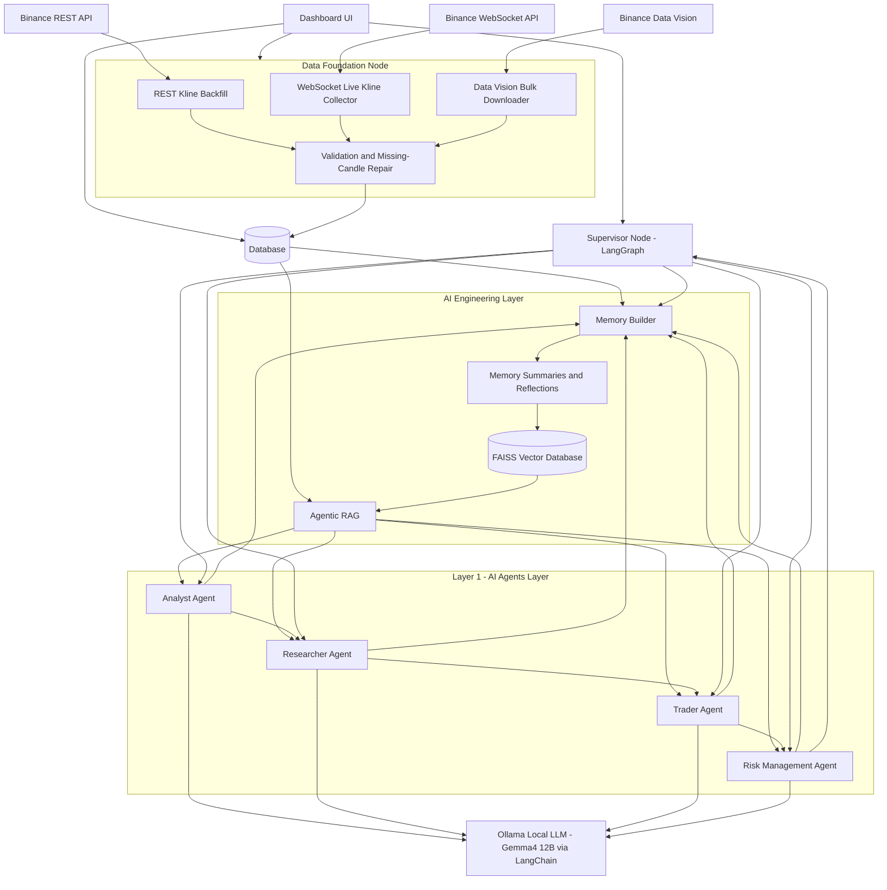

# System Architecture

This file tracks the evolving system architecture for the Crypto Trading AI Agent.

## Current Runtime Architecture

The architecture now consists of a `Dashboard Layer` for operator control, a `Data Foundation Node` for Binance ingestion and persistent storage, an `AI Engineering Layer` for retrieval, memory construction, and vector search, and a `Supervisor Node` implemented as a LangGraph state machine. The agent layer shares a local Ollama runtime through LangChain structured outputs targeting `gemma4:12b`.

## Agent Responsibilities

- `Dashboard UI`: provides the current operator surface for `Backtest`, `Paper Trading`, and `Live Trading` demo mode, with `Run`, `Stop`, component health, live agent activity, and alert monitoring.
- `Data Foundation Node`: ingests Binance market data, validates candles, repairs gaps, and maintains the SQLite `clean_ohlcv` store.
- `Database`: is the persistent store for QuantCrypt market data, reports, and memory artifacts.
- `AI Engineering Layer`: prepares retrieval-ready context, builds memory artifacts, and serves semantic retrieval to the agent layer.
- `Memory Builder`: converts system outputs and historical data into retrieval-ready memory artifacts.
- `Memory Summaries and Reflections`: hold past decisions, trade outcomes, market summaries, research notes, and risk verdicts in summarized form.
- `Agentic RAG`: retrieves structured evidence from the database and semantic evidence from memory retrieval.
- `FAISS Vector Database`: stores embeddings for summarized memory artifacts rather than raw candle data.
- `Supervisor Node - LangGraph`: orchestrates calls across all layers through a typed state graph, manages execution order, and makes the final decision.
- `Analyst Agent`: performs fundamental, sentiment, news, and technical analysis.
- `Researcher Agent`: debates the analyst output through bullish and bearish reasoning inside one node.
- `Trader Agent`: synthesizes the debate into a preliminary trade decision.
- `Risk Management Agent`: classifies the trade as high, medium, or low risk and returns the risk view to the supervisor.
- `Ollama Local LLM - Gemma4 12B via LangChain`: provides the shared chat backend used by the four Layer 1 agents, with schema-validated outputs at the LLM boundary.

## Notes

- `Live Trading` in the dashboard is still `demo account only`.
- The `Live Monitor` view is the first observability surface and should show component health, agent activity, and critical alerts.
- `Backtest` is read-only and must not write hypothetical decisions into the persistent memory store.
- Risk control must exist before live execution is allowed.
- The architecture diagram should be added or updated whenever a new subsystem becomes real code.
