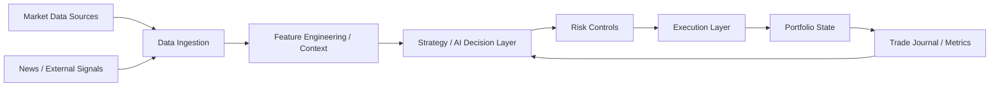

# System Architecture

This is the initial target architecture for the Crypto Trading AI Agent. It is a planning diagram, not an implementation report yet.

## Notes

- The first implementation should stay in `paper trading` mode.
- Risk control must exist before live execution is allowed.
- The architecture diagram should be updated whenever a new subsystem becomes real code.

